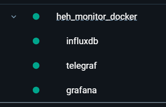
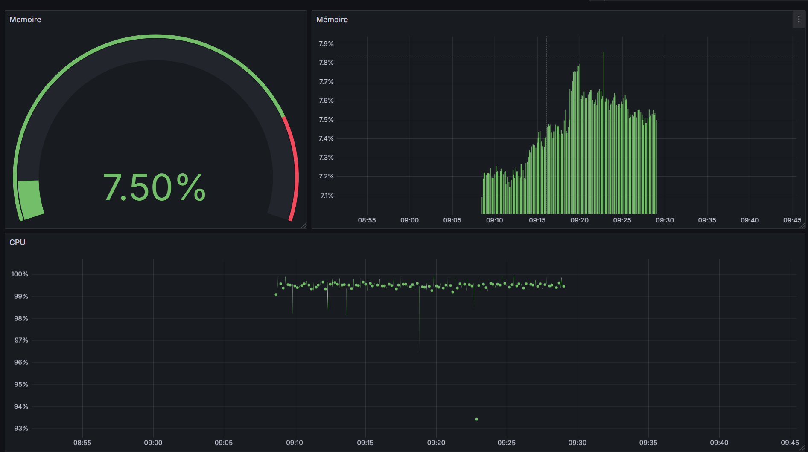

# Projet de Monitoring — TIG Stack (Telegraf, InfluxDB, Grafana)

## Objectif

Déployer une solution de monitoring complète pour un système Linux à l’aide de la **stack TIG** :

* **Telegraf** : collecte des métriques (CPU, mémoire, swap, etc.)
* **InfluxDB** : stocke les séries temporelles
* **Grafana** : visualise les données via des tableaux de bord dynamiques

---

## Architecture

```
[Linux System]
      │
      ▼
+-------------+
|  Telegraf   | → collecte CPU / RAM toutes les 10s
+-------------+
      │ (HTTP)
      ▼
+-------------+
|  InfluxDB   | → stocke les mesures dans la DB "telegraf"
+-------------+
      │ (HTTP)
      ▼
+-------------+
|  Grafana    | → visualise les métriques via dashboard
+-------------+
```

---

## Aperçus

### Conteneurs Docker



### Tableau de bord Grafana



---

## Structure du projet

```
HEH_MONITOR_DOCKER/
├─ grafana/
│  ├─ dashboards/
│  │  ├─ dashboard.png
│  │  └─ telegraf-cpu-mem.json
│  ├─ provisioning/
│  │  ├─ datasources/
│  │  │  └─ influxdb.yaml
│  │  └─ dashboards/
│  │     └─ dashboards.yaml
├─ scripts/
│  └─ create-influx-db.sh
├─ telegraf/
│  └─ telegraf.conf
├─ docker-compose.yml
├─ docker.png
├─ ProjetMonitoring.pdf
└─ README.md
```

---

## Installation et exécution

### 1. Prérequis

* **Docker Desktop** ou **Docker Engine + Compose**
* Ports disponibles : `8086` (InfluxDB) et `3000` (Grafana)

### 2. Démarrage

```bash
docker compose up -d
```

### 3. Vérifications

```bash
docker logs -f telegraf
# Doit afficher des lignes : "Wrote batch of X metrics"

docker exec -it influxdb influx -execute "SHOW MEASUREMENTS ON telegraf"
# Résultat attendu : cpu, mem
```

---

## Accès à Grafana

Ouvrir : [http://localhost:3000](http://localhost:3000)

**Identifiants par défaut :**

```
admin / admin
```

Datasource **InfluxDB** auto-provisionnée :

```yaml
url: http://influxdb:8086
database: telegraf
```

---

## Tableau de bord Grafana

Dashboard->Import->Sélectionner *telegraf-cpu-men.json*
Nom : **MonitoringDashboard**

### Panneaux inclus

1. **CPU (Stat)** — utilisation instantané :

   ```sql
      SELECT 100 - mean("usage_idle")
      FROM "cpu"
      WHERE $timeFilter AND "cpu"='cpu-total'
   ```
2. **CPU (Time series)** — évolution temporelle consomation cpu en %:

   ```sql
      SELECT 100 - mean("usage_idle")
      FROM "cpu"
      WHERE $timeFilter AND "cpu"='cpu-total'
      GROUP BY time($__interval) fill(null)
   ```
3. **Mémoire (Stat)** — utilisation instantané.
   ```sql
      SELECT (last("total") - last("available")) / 1024 / 1024 / 1024
      AS "RAM utilisée (GiB)"
      FROM "mem"
      WHERE $timeFilter
   ```
4. **Mémoire (Time series)** — évolution temporelle consomation mémoire en %:

   ```sql
      SELECT 100 * (mean("total") - mean("available")) / mean("total")
      AS "RAM utilisée (%)"
      FROM "mem"
      WHERE $timeFilter
      GROUP BY time($__interval) fill(null)
   ```
---

## Commandes utiles

| Action               | Commande                           |
| -------------------- | ---------------------------------- |
| Démarrer             | `docker compose up -d`             |
| Arrêter              | `docker compose down`              |
| Logs d’un service    | `docker logs -f <service>`         |
| Recréer un conteneur | `docker compose restart <service>` |
| Supprimer volumes    | `docker compose down -v`           |

---

## Résumé du fonctionnement

1. **Telegraf** interroge le système toutes les 10 s.
2. **InfluxDB** crée automatiquement la base `telegraf` au premier démarrage.
3. Les métriques CPU/Mémoire y sont stockées.
4. **Grafana** interroge cette base et affiche les graphiques.
5. Le script `create-influx-db.sh` reste optionnel pour réinitialiser manuellement.

---

## Auteur

Projet scolaire réalisé par **Tom Deneyer**
HEH — Bachelor 3 Informatique

Versions utilisées :
* Telegraf : 1.30.3
* InfluxDB : 1.8.10
* Grafana : 12.2.1
